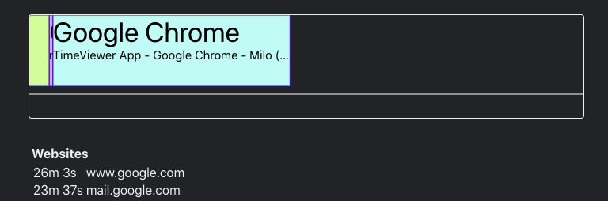

# TimeViewer

A "simple" app to track your time

* `cd server; cargo run` (or `cargo run & disown` to make a process that lasts after killing the terminal)
* `cd client; pnpm i; pnpm run start`
* `open monitor/TimeViewer.xcodeproj` and build and run
